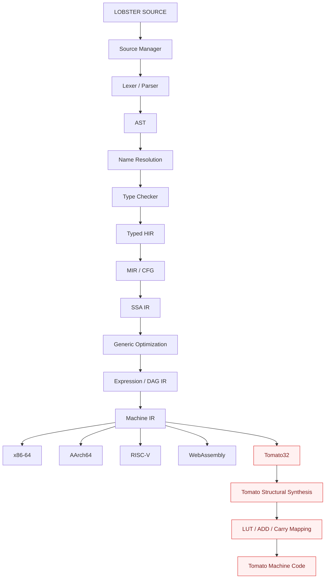

<h1 align="center">Lobster - A Programming Language for Dual LUT3 CPU Architectures</h1>
<p align="center"><strong>A statically typed systems programming language, optimizing compiler, adaptive runtime, and multi-target toolchain built from first principles.</strong></p>
<p align="center">
  <a href="docs/status.md"></a>
  <a href="docs/spec.md"></a>
  <a href="https://www.rust-lang.org/"></a>
  <a href="LICENSE"></a>
</p>

Lobster must not assume that every machine behaves like a conventional two-input
CPU. Its compiler architecture preserves enough program structure to discover
and exploit unusual target capabilities — `a + b + c`, arbitrary LUT3 Boolean
functions, dual-LUT packing, LUT → adder compositions, selectable carry
sources, multi-output instructions — especially for Tomato.

**Explore:** [current status](docs/status.md) ·
[language spec](docs/spec.md) ·
[decisions](docs/adr/) ·
[Tomato ISA](https://github.com/tmarhguy/tomato/tree/main/docs/isa)

## Architecture at a glance

One source language, one optimizer, five targets. Tomato gets structural
synthesis instead of conventional instruction sequences:



[Diagram source](docs/diagrams/pipeline.mmd).

## Authority and state boundaries

- **Edit:** `docs/spec.md`, `docs/status.md`, crate sources, `examples/`.
  These are the authorities for implemented behavior: they describe what
  the repository actually proves, not what is planned.
- **External authority:** the Tomato ISA lives in the sibling
  [tomato](https://github.com/tmarhguy/tomato) repository
  (`docs/isa/*.csv` plus `software/assembler.py`). Lobster carries no private
  copy of Tomato opcodes — same rule as Tomato's own assembler.
- **Runtime state:** the reference interpreter executes MIR CFGs
  (`lobster run`). No JIT or hardware execution exists yet; see the table below.

## What runs now

Every claim is backed by the working tree at Commit 05. Anything else is
roadmap, not status.

| Layer | Current, repository-backed statement |
|---|---|
| Workspace | `cargo build --workspace` produces the `lobster` binary (thirteen crates) |
| Source manager | Stable file IDs, spans, 1-based line/col; unit-tested incl. Unicode columns |
| Diagnostics | `error[E021]`-style rendering with primary/secondary spans, notes, suggestions; snapshot-tested |
| CLI | `lobster check <file>` lexes, parses, resolves, type-checks, and reports `ok` or `E1xx`/`E2xx`/`LOBSTER-00x`; `lobster run <file> [--dump-mir --dump-ssa --verify-ssa]` verifies SSA (`SSA-verify`, fail closed) then executes `main` via the reference interpreter and reports `TRAP-*` on failure; all other subcommands exit 2 as honest stubs |
| Frontend | Lexer, Pratt parser, and span-annotated AST. `a + b * c` parses as `ADD(a, MUL(b, c))`; errors recover at `;`/`}` with `E1xx` codes; lexer/parser never panic (corpus + truncation + byte tests) |
| Sema | Single-file name resolution (E200–E203) and bidirectional type checking (E210–E218): literal adoption, no implicit conversions, cast table, exhaustiveness, 14 compile-fail snapshots |
| HIR/MIR | Typed desugared HIR (`&&`/`||` → `if`); MIR CFG with explicit branches, `match` dispatch, index loops for `for`; `--dump-mir` prints the CFG |
| SSA | Single-assignment CFG with one phi per local at every join (`--dump-ssa`); verifier checks structure, single-def, phi/predecessor agreement, operand and operator types; every `run` verifies SSA first and fails closed on `SSA-verify` errors |
| Interpreter | Strict spec §§4–5 execution: wrapping ints, trapping `/`/`%` by zero, masked shifts, saturating `float as int`, trapping `u32 as char`, honest `TRAP-REF` for `&`/`*` |
| Examples | Six checked-in programs, all passing `lobster check` and `lobster run`; `tomato_shapes.lobster` exercises the expression shapes from the verified Tomato catalog |

## See it, run it, inspect it

```bash
cargo build
./target/debug/lobster --help
./target/debug/lobster check examples/hello.lobster
./target/debug/lobster run examples/hello.lobster
```

Focused checks (same as CI):

```bash
cargo fmt --all -- --check
cargo clippy --workspace --all-targets -- -D warnings
cargo test --workspace
```

> macOS note: the default toolchain on this machine ships a `MacOSX27.0.sdk`
> its bundled linker cannot parse, so plain `cargo build` fails inside
> proc-macro build scripts with `unknown architecture arm64e.x1-macos`.
> Until the toolchain is updated, prefix cargo commands with
> `SDKROOT=/Library/Developer/CommandLineTools/SDKs/MacOSX15.4.sdk`.
> See [ADR 002](docs/adr/002-macos-first.md).

## Repository map

| Path | Purpose |
|---|---|
| [`docs/spec.md`](docs/spec.md) | Evolving language specification |
| [`docs/language-spec.md`](docs/language-spec.md) | Normative language reference (decided vs open) |
| [`docs/status.md`](docs/status.md) | Current facts and milestone tracker |
| [`docs/adr/`](docs/adr/) | Architecture decision records |
| [`docs/diagrams/`](docs/diagrams/) | Diagram sources (Mermaid) |
| [`docs/tomato/`](docs/tomato/) | Verified Tomato ISA research, gaps, ADR 004 |
| [`crates/lobster-source/`](crates/lobster-source/) | Source manager: files, spans, line/col |
| [`crates/lobster-diagnostics/`](crates/lobster-diagnostics/) | Spanned diagnostics and renderer |
| [`crates/lobster-ast/`](crates/lobster-ast/) | Span-annotated syntax tree |
| [`crates/lobster-lexer/`](crates/lobster-lexer/) | Lexer: tokens, numbers, strings, comments |
| [`crates/lobster-parser/`](crates/lobster-parser/) | Pratt parser with recovery |
| [`crates/lobster-types/`](crates/lobster-types/) | Semantic type language |
| [`crates/lobster-resolve/`](crates/lobster-resolve/) | Name resolution |
| [`crates/lobster-sema/`](crates/lobster-sema/) | Type checker + compile-fail suite |
| [`crates/lobster-hir/`](crates/lobster-hir/) | Typed desugared HIR (Commit 04) |
| [`crates/lobster-mir/`](crates/lobster-mir/) | CFG / basic blocks (Commit 04) |
| [`crates/lobster-interp/`](crates/lobster-interp/) | Reference interpreter (Commit 04) |
| [`crates/lobster-ssa/`](crates/lobster-ssa/) | SSA IR + verifier (Commit 05) |
| [`crates/lobster-cli/`](crates/lobster-cli/) | `lobster` command-line interface |
| [`examples/`](examples/) | Checked-in programs, all passing `lobster check` and `lobster run` |
| [`log/`](log/) | Dated engineering journal; history, not authority |

## Roadmap

Twenty milestone commits (tracked in [docs/status.md](docs/status.md)),
worked in order. This checkout completes **Commit 05**
(`SSA + verifier`).
Next: **Commit 06** — optimizer + levels. The flagship arc runs frontend → types → interpreter → SSA →
optimizer → Machine IR → x86 → differential testing → RISC-V/WASM → AArch64
→ Tomato baseline → ADD3 → LUT synthesis → Dual-LUT packing → polymorphic
instruction synthesis → toolchain → explorer/release.

## Core rules

- Correct semantics first. Fast wrong code is failure.
- No `Lobster → C → GCC`. No `Lobster → LLVM IR → LLVM does everything` core
  compiler. LLVM may later appear only as a validation backend or oracle.
- Every substantial subsystem ships implementation + unit tests + negative
  tests + integration tests + documentation — a feature is not complete
  because one example compiles.

## Documentation and history

Start with [`docs/README.md`](docs/README.md). It separates current
reference material from the dated [`log/`](log/) engineering record. The
journal preserves decisions, wrong turns, and superseded designs as history;
do not cite it for present status unless a current guide confirms it.

## License and author

MIT ([`LICENSE`](LICENSE)).
Architecture and project by **Tyrone Marhguy**, Computer Engineer,
University of Pennsylvania, Junior, Class of 2028.

[Contributing](CONTRIBUTING.md) · [security](SECURITY.md) ·
[citation](CITATION.cff)
